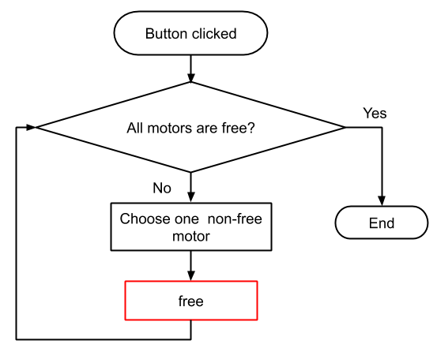

# Documentation for the calibration machine of MagikEye
<!-- TOC -->

- [Documentation for the calibration machine of MagikEye](#documentation-for-the-calibration-machine-of-magikeye)
    - [Operating environment](#operating-environment)
    - [Main Window ("KeiganGUI")](#main-window-keigangui)
        - [Robot Control](#robot-control)
        - [IR Light Control](#ir-light-control)
        - [Scripting](#scripting)
        - [Other](#other)
    - [Sub Window ("Sensor Window")](#sub-window-sensor-window)
        - [RPi address](#rpi-address)
        - [Camera Control](#camera-control)
        - [Laser Control](#laser-control)
        - [Other](#other-1)
    - [Scripting Window ("Progress")](#scripting-window-progress)

<!-- /TOC -->

## Operating environment
- Ubuntu xxx
- Python 3.6.9 or newer

First, check if the project `keiganGUI` exists at 
`\home\bin`
then go to terminal and you can run this command:
`python3 bin/keiganGUI/keiganGUI.py`

Then, you will see the main window like the image below.

## Main Window ("KeiganGUI")
<!-- 
  
-->
  

This window mainly consists of 3 parts, **Robot Control**, **IR Light Control**, and **Scripting**.

### Robot Control
In this part, you can configure and move the motors. There are three motors in the calibration robot: **Slider**, **Pan**, and **Tilt**. 
The function of each numbered widgets in the GUI is as follows: 

1. `Initialize button` initializes all of the three motors and open the port of IR lights. This button will be disabled after finishing initialization.  
 

2. `Set Slider Origin button` can set the origin point of the slider motor. When finished, information message will be popped up so be patient until then.  
 

3. `FREE all motors button` releases the restrain states of all motors. Holding torque will be reduced whereas the configuration of motors will be maintained.  
 

4. `REBOOT all motors button`, on the other hand, turns off all motors and the configuration will not be maintained. If you want to use motors again, you should click `Initialize button`.  
 

5. This `Progress Bar` can be used when you want to check the progress of 
- motor initialization (when clicked ①)
- going to origin (when clicked ⑫)

6. In this part (`Motor Positions`), you can specify the position of each motor in the spin box. Notice that the unit of value for Slider, Pan, and Tilt are <u>mm</u>, <u>deg</u>, and <u>deg</u> respectively. If you click  buttons, you can send a command to each motor and the robot will change the posture by moving the motor.  
 

7. `Save button` allows you to save motor positions as specified at the spin boxes in `Motor Positions`. Sets of motor positions will be stored in the combo box ⑧.  
 

8. `Saved Positions` stores motor positions which you saves. You can choose a set of motor positions from the combo box, and move motors by clicking  button.  
 

9. `Set speed` allows you to change the rotation speed of each motor.  
 

10. In `Preset`, firstly choose a motor ID from the combo box and type a value which you want to set as the motor's current position. The text of the label indicating the unit will be changed depending on the motor ID.  
 

11. `SET Origin button` sets the current positions of all motors origin (0, 0, 0).  
 

12. `GO TO Origin button` moves all motors to the point of origin.  
 

13. In `Current Pos.`, you can check the current positions of all motors.  

### IR Light Control
14. You can control lights (L1 and L2) respectively. By clicking , the light will be turned on. On the other hand,  button allows you to turn off the light.   
 

### Scripting
15. The name of a script you chose will be shown here.  

16. If you click `Select Script tool button`, file dialog will be opened and you can select a script. Choose a file with extension <u>.txt</u>.  
 

17. If `Continue Script button` is clicked, scripting will be resumed where you left off last session. If you haven't clicked ⑱, this button has the same role as ⑱. 
 

18. If `Execute Script button` is clicked, the selected script will be executed from the beginning. Acquired data while scripting will be saved in a different folder so as not to overwrite the existing data.  
 

### Other
19. By clicking `Sensor Window button`, the sensor window will appear.  
 

20. `MagikEye button` is a button for performing a demonstration of the calibration machine. The robot will move along a demo-script.  
 

## Sub Window ("Sensor Window")
  

You can directly control the state of sensor devices through this window.
It mainly consists of 3 parts, **RPi address**, **Camera Control**, and **Laser Control**.

### RPi address
1. Before connecting sensors, specify the IP address and port number here. The format is <u>(IP address):(port number)</u>.You can also specify only IP address. In that case, port number will be set as default(8888). 
 

### Camera Control
In this part, you can change parameters of a camera and get images.

2. You can change `Shutter Speed` of the camera. Notice that the unit of the value is <u>μs</u>.  
 

3. You can specify the `number of frames` for averaging images.   
 

4. You can change `ISO value` by both selecting from the combo box and typing a number. 
 

5. You can `preview` an image from the camera. `1` button is for a normal image, and `#` button is for an averaged image.  
 

6. You can `preview and save` an image from the camera. Function of each button is same as ⑤.   
 

### Laser Control
In this part, you can control lasers and check the state.

7. You can set a laser pattern by clicking buttons. `EVEN` button is for turning on only even-numbered lasers, `ODD` for odd-numbered,  for all lasers, and  for turning off all lasers.  
 

8. You can set a laser pattern by specifying with a 4-digit hexadecimal number. The flowchart is same as ⑦.  

9. You can check the current laser patten. Lasers are from No.1 to No.16.  

### Other
10. Here, you will see `Sensor Image` by clicking buttons in ⑤ or ⑥.   

11. You can check the status of the camera. A message will be shown if there is a trial to connect to sensors, or parameters are changed.  

12. By clicking `Reconnect button`, you can reconnect to sensors.  
 

## Scripting Window ("Progress")
  

While scripting, this window will appear.

1. You can check the progress in detail. The number of <u>(processed lines) / (total lines)</u> in the script is indicated. The progress percentage is also indicated in the progress bar at the center of this window. 

2. This is a `command name` being processed.

3. By clicking `Stop button`, this window will be closed and the process of scripting will be interrupted.

