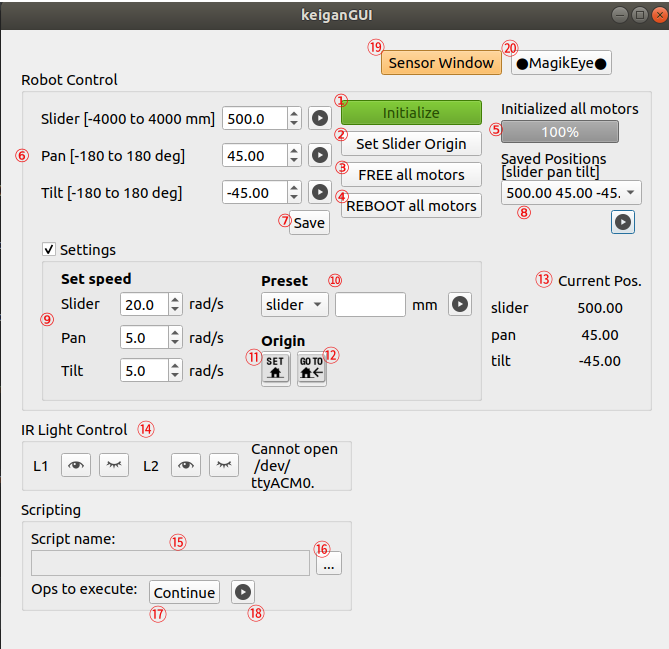

<a id="markdown-documentation-for-the-calibration-machine-of-magikeye" name="documentation-for-the-calibration-machine-of-magikeye"></a>
# Documentation for the calibration machine of MagikEye
<!-- TOC -->

- [Documentation for the calibration machine of MagikEye](#documentation-for-the-calibration-machine-of-magikeye)
    - [Operating Environment](#operating-environment)
    - [Operation Manual](#operation-manual)
        - [Main Window ("KeiganGUI")](#main-window-keigangui)
            - [Robot Control](#robot-control)
            - [IR Light Control](#ir-light-control)
            - [Scripting](#scripting)
            - [Other](#other)
        - [Sub Window ("Sensor Window")](#sub-window-sensor-window)
            - [RPi address](#rpi-address)
            - [Camera Control](#camera-control)
            - [Laser Control](#laser-control)
            - [Other](#other-1)
        - [Scripting Window ("Progress")](#scripting-window-progress)
    - [Script Grammar](#script-grammar)
        - [set (command)](#set-command)
        - [mov (command)](#mov-command)
        - [home (command)](#home-command)
        - [lasers (command)](#lasers-command)
        - [light (command)](#light-command)
        - [gainiso (command)](#gainiso-command)
        - [shutter (command)](#shutter-command)
        - [snap (command)](#snap-command)
    - [Flowcharts](#flowcharts)
        - [Main Window ("KeiganGUI")](#main-window-keigangui-1)
            - [Robot Control](#robot-control-1)
            - [IR Light Control](#ir-light-control-1)
            - [Scripting](#scripting-1)
            - [Other](#other-2)
        - [Sub Window ("Sensor Window")](#sub-window-sensor-window-1)
            - [RPi address](#rpi-address-1)
            - [Camera Control](#camera-control-1)
            - [Laser Control](#laser-control-1)
            - [Other](#other-3)

<!-- /TOC -->
<!-- https://dev.classmethod.jp/articles/vscode-markdown-toc-for-blog/ -->

<a id="markdown-operating-environment" name="operating-environment"></a>
## Operating Environment
* Ubuntu 18.04.3 LTS
* Python 3.6.9

First, check if the project `keiganGUI` exists at 
`\home\bin`
then go to terminal and you can run this command:  
`python3 bin/keiganGUI/keiganGUI.py`

Then, you will see the main window like the image below.

<a id="markdown-operation-manual" name="operation-manual"></a>
## Operation Manual

<a id="markdown-main-window-keigangui" name="main-window-keigangui"></a>
### Main Window ("KeiganGUI")
<!-- 
  
-->
  

This window mainly consists of 3 parts, **Robot Control**, **IR Light Control**, and **Scripting**.
<a id="markdown-robot-control" name="robot-control"></a>
#### Robot Control
In this part, you can configure and move the motors. There are three motors in the calibration robot: **Slider**, **Pan**, and **Tilt**. 
The function of each numbered widgets in the GUI is as follows: 

1. `Initialize button` initializes all of the three motors and open the port of IR lights. This button will be disabled after finishing initialization.  

2. `Set Slider Origin button` can set the origin point of the slider motor. When finished, information message will be popped up so be patient until then.  

3. `FREE all motors button` releases the restrain states of all motors. Holding torque will be reduced whereas the configuration of motors will be maintained.  

4. `REBOOT all motors button`, on the other hand, turns off all motors and the configuration will not be maintained. If you want to use motors again, you should click `Initialize button`.  

5. This `Progress Bar` can be used when you want to check the progress of 
* motor initialization (when clicked ①)
* going to origin (when clicked ⑫)

6. In this part (`Motor Positions`), you can specify the position of each motor in the spin box. Notice that the unit of value for Slider, Pan, and Tilt are <u>mm</u>, <u>deg</u>, and <u>deg</u> respectively. If you click  buttons, you can send a command to each motor and the robot will change the posture by moving the motor.  

7. `Save button` allows you to save motor positions as specified at the spin boxes in `Motor Positions`. Sets of motor positions will be stored in the combo box ⑧.  

8. `Saved Positions` stores motor positions which you saves. You can choose a set of motor positions from the combo box, and move motors by clicking  button.  

9. `Set speed` allows you to change the rotation speed of each motor.  

10. In `Preset`, firstly choose a motor ID from the combo box and type a value which you want to set as the motor's current position. The text of the label indicating the unit will be changed depending on the motor ID.  

11. `SET Origin button` sets the current positions of all motors origin (0, 0, 0).  

12. `GO TO Origin button` moves all motors to the point of origin.  

13. In `Current Pos.`, you can check the current positions of all motors.  

<a id="markdown-ir-light-control" name="ir-light-control"></a>
#### IR Light Control
14. You can control lights (L1 and L2) respectively. By clicking , the light will be turned on. On the other hand,  button allows you to turn off the light.   

<a id="markdown-scripting" name="scripting"></a>
#### Scripting
15. The name of a script you chose will be shown here.  

16. If you click `Select Script button`, file dialog will be opened and you can select a script. Choose a file with extension <u>.txt</u>.  

17. If `Continue Script button` is clicked, scripting will be resumed where you left off last session. If you haven't clicked ⑱, this button has the same role as ⑱. 

18. If `Execute Script button` is clicked, the selected script will be executed from the beginning. Acquired data while scripting will be saved in a different folder so as not to overwrite the existing data.  

<a id="markdown-other" name="other"></a>
#### Other
19. By clicking `Sensor Window button`, the sensor window will appear.  

20. `MagikEye button` is a button for performing a demonstration of the calibration machine. The robot will move along a demo-script.  

<a id="markdown-sub-window-sensor-window" name="sub-window-sensor-window"></a>
### Sub Window ("Sensor Window")
  

You can directly control the state of sensor devices through this window.
It mainly consists of 3 parts, **RPi address**, **Camera Control**, and **Laser Control**.

<a id="markdown-rpi-address" name="rpi-address"></a>
#### RPi address
1. Before connecting sensors, specify the IP address and port number here. The format is <u>(IP address):(port number)</u>.You can also specify only IP address. In that case, port number will be set as default(8888). 

<a id="markdown-camera-control" name="camera-control"></a>
#### Camera Control
In this part, you can change parameters of a camera and get images.

2. You can change `Shutter Speed` of the camera. Notice that the unit of the value is <u>μs</u>.  

3. You can specify the `number of frames` for averaging images.   

4. You can change `ISO value` by both selecting from the combo box and typing a number. 

5. You can `preview` an image from the camera. `1` button is for a normal image, and `#` button is for an averaged image.  

6. You can `preview and save` an image from the camera. Function of each button is same as ⑤.   

<a id="markdown-laser-control" name="laser-control"></a>
#### Laser Control
In this part, you can control lasers and check the state.

7. You can set a laser pattern by clicking buttons. `EVEN` button is for turning on only even-numbered lasers, `ODD` for odd-numbered,  for all lasers, and  for turning off all lasers.  

8. You can set a laser pattern by specifying with a 4-digit hexadecimal number. The flowchart is same as ⑦.  

9. You can check the current laser patten. Lasers are from No.1 to No.16.  


<a id="markdown-other-1" name="other-1"></a>
#### Other
10. Here, you will see `Sensor Image` by clicking buttons in ⑤ or ⑥.   

11. You can check the status of the camera. A message will be shown if there is a trial to connect to sensors, or parameters are changed.  

12. By clicking `Reconnect button`, you can reconnect to sensors.  

<a id="markdown-scripting-window-progress" name="scripting-window-progress"></a>
### Scripting Window ("Progress")
  

While scripting, this window will appear.

1. You can check the progress in detail. The number of <u>(processed lines) / (total lines)</u> in the script is indicated. The progress percentage is also indicated in the progress bar at the center of this window. 

2. This is a `command name` being processed.

3. By clicking `Stop button`, this window will be closed and the process of scripting will be interrupted.

<a id="markdown-script-grammar" name="script-grammar"></a>
## Script Grammar  
You can see an example script [here](script/script_2019-12-05_M_TOF_Archimedes_N=12_lendt=2.txt).

Lines which start with "#" or empty ones will be skipped while executing.
The general structure is:  
`command` `1st argument, 2nd argument, 3rd argument`.
However, the number of arguments is different depending on commands.

<a id="markdown-set-command" name="set-command"></a>
### set (command)
This command sets a variable of 1st argument as a value of 2nd argument.
For example, 
> set pattern1_laser_image, "pattern1/laser/img_@{seqn}{4}_@{lasers}{4}_@{slide}{4}_@{pan}{4}_@{tilt}{4}.png"

this means that a variable `pattern1_laser_image` has a value `pattern1/laser/img_@{seqn}{4}@{lasers}{4}@{slide}{4}@{pan}{4}@{tilt}{4}.png` which is a file path to save an image and represented as a regular expression.
The structure is `@{variable name}{the number of digit}`.
Each variable means:
* seqn: sequence number of am image(start from 1)
* lasers: light emitting pattern of lasers (decimal bit0: Laser 1, bit1: Laser 2, ..., bit15, Laser 16)
* slider: position of Slider [mm]
* pan: position of Pan [deg]
* tilt: position of Tilt [deg]

If seqn = 40, lasers = 1, slider = 500, pan = 45, and tilt = 90, then the value will be `pattern1/laser/img_0040_0001_0500_0045_0090.png`

<a id="markdown-mov-command" name="mov-command"></a>
### mov (command)
This command has 3 arguments which specify positions of Slider, Pan, and Tilt. The robot will move to the position.

<a id="markdown-home-command" name="home-command"></a>
### home (command) 
This command has no arguments and can make the robot move to the home position(origin). This command is equivalent to `mov 0, 0, 0`

<a id="markdown-lasers-command" name="lasers-command"></a>
### lasers (command)
This command has an argument which is corresponding to the laser number to emit light. Note that this is different from 'lasers' as an variable.

<a id="markdown-light-command" name="light-command"></a>
### light (command)
This command has 2 arguments. The 1st argument represents IR light number(No.1 or No.2), and the 2nd argument represents ON(1)/OFF(0).

<a id="markdown-gainiso-command" name="gainiso-command"></a>
### gainiso (command)
This command can set ISO value as the 1st argument.

<a id="markdown-shutter-command" name="shutter-command"></a>
### shutter (command)
This command can set shutter speed as the 1st argument.

<a id="markdown-snap-command" name="snap-command"></a>
### snap (command)
This command has 2 arguments. The 1st argument is image category, which was defined at [set command](#set-command). The image will be saved based on the state of the robot at that time. The 2nd argument is a frame number for averaging the image.

### Advanced scripting
Recent versions include a new DSL parser implemented with Lark.
You can use expressions, loops and functions.
Example:
```dsl
set x, 10
function repeat_move(n){
    for i in range(0, n){
        mov 0, i*10, 0
    }
}
repeat_move(5)
```

<a id="markdown-flowcharts" name="flowcharts"></a>
## Flowcharts

<a id="markdown-main-window-keigangui-1" name="main-window-keigangui-1"></a>
### Main Window ("KeiganGUI")

<a id="markdown-robot-control-1" name="robot-control-1"></a>
#### Robot Control

1. `Initialized button`  
 

2. `Set Slider Origin button`  
 

3. `FREE all motors button`  
 

4. `REBOOT all motors button`  
  

</t>

6. `Motor Positions`  
 

7. `Save button`   
 

8. `Saved Positions`  
 

9. `Set speed`  
 

10. `Preset`  
 

11. `SET Origin button`  
 

12. `GO TO Origin button`  
 

<a id="markdown-ir-light-control-1" name="ir-light-control-1"></a>
#### IR Light Control
14. IR Light Control  
 

<a id="markdown-scripting-1" name="scripting-1"></a>
#### Scripting

16. `Select Script button`  
 

17. `Continue Script button`  
 

18. `Execute Script button`  
 

<a id="markdown-other-2" name="other-2"></a>
#### Other
19. `Sensor Window button`  
 

20. `MagikEye button`  
 

<a id="markdown-sub-window-sensor-window-1" name="sub-window-sensor-window-1"></a>
### Sub Window ("Sensor Window")

<a id="markdown-rpi-address-1" name="rpi-address-1"></a>
#### RPi address
1. `RPi address`  
 

<a id="markdown-camera-control-1" name="camera-control-1"></a>
#### Camera Control

2. `Shutter Speed`  
 

3. `number of frames`    
 

4. `ISO value`   
 

5. `preview`  
 

6. `preview and save`   
 


<a id="markdown-laser-control-1" name="laser-control-1"></a>
#### Laser Control

7. `EVEN`, `ODD`, ,   
 

<a id="markdown-other-3" name="other-3"></a>
#### Other
12. `Reconnect button`  
 

